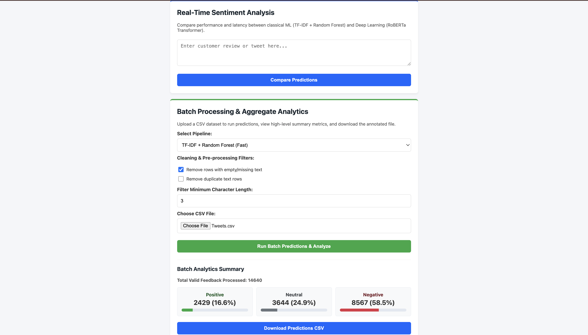

# Airline Sentiment Analysis App

  

A Flask web application that classifies airline customer feedback into **Positive**, **Neutral**, or **Negative** sentiment using a custom TF-IDF and Machine Learning pipeline.



## Features

- **Real-Time Model Benchmarking:** Compare TF-IDF + Random Forest vs. RoBERTa Transformer in real time for single inputs.
- **Data Preprocessing & Cleaning Filters:** Remove empty rows, drop duplicates, and filter by minimum text character length directly from the UI.
- **Batch CSV Processing & High-Throughput Analytics:** Process large datasets using batched model inference (`batch_size=32`).
- **Aggregate Business Intelligence Analytics:** View real-time visual percentage breakdowns (Positive, Neutral, Negative) and progress metrics for uploaded datasets.
- **Dataset Export:** Download updated, sentiment-annotated CSV files (`sentiment_predictions.csv`).
- Custom text preprocessing preserving negation keywords (*not*, *no*, *don't*).
- Flask web interface for real-time sentiment prediction.
- Automated retraining pipeline.

## Setup & Running Locally

1. **Clone the repository:**
   ```bash
   git clone [https://github.com/Kin09/airline_sentiment_project.git](https://github.com/Kin09/airline_sentiment_project.git)
   cd airline_sentiment_project
   ```

2. **Set up virtual environment:**
   ```bash
   python3 -m venv my_env
   source my_env/bin/activate
   pip install -r requirements.txt
   ```

3. **Train the model:**
   ```bash
   python src/train.py
   ```

4. **Launch the web application:**
   ```bash
   python app.py
   ```
